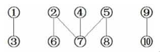
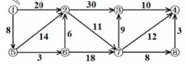
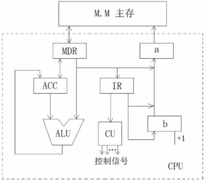
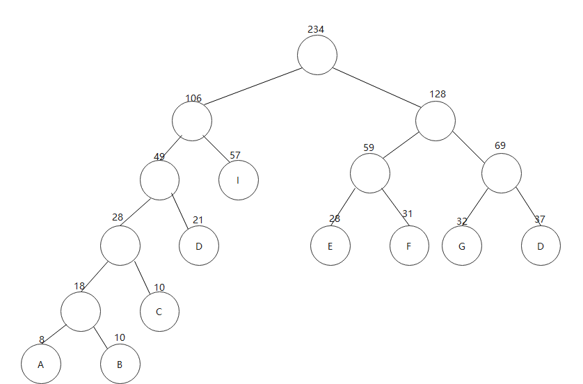

# 2014
_ _ _ _ _
[](https://github.com/HFUT-cskaoyan/zhenti)  
[](#language)
[](#commit)
****
## <center>数据结构</center>
### 一、选择题
1. 对于顺序存储的线性表，访问节点和增加、删除节点的时间复杂度为( ).  
A.O(n) 和 O(n)&emsp; B.O(n) 和 O(1)&emsp; C.O(1) 和 O(n) &emsp; D.O(1) 和 O(1)
2. 一棵左右子树均不空的二叉树在先序线索化后，其中空的链域的个数是( ).  
A.0&emsp;B.1&emsp;C.2&emsp;D. 不 确 定
3. 在图采用邻接表存储时，求最小生成树的 Prim 算法的时间复杂度为( ).  
A.O(n) &emsp;B.(n+e) &emsp;C.O(n²) &emsp;D.(n³)
4. n 个顶点无向连通图最少有（ ）条边.  
A.O(n²)&emsp; B.O(n)&emsp;C.O(n-1)&emsp;D.O(log2n)  
5. 对序列{15，9，7，8，20，-1，4}进行排序，进行一趟后数据的排列变为{4， 9，-1，8，20，7，15}，则采用的是（ ）排序.  
A. 选 择&emsp;B. 快 速&emsp;C. 希 尔&emsp; D. 冒 泡
### 二、解答题
1. 求出下图中从顶点 1 到其余各顶点的最短路径。  

1. 对下面数据表，构建哈夫曼树，并计算其带权路径长度。  
（8，10，21，32，57，31，28，37，10）
3. 给出下列程序，写出 print（5）的运行结果  
```c++
void print(int n)
{
if(n==0)
return;
else
{
print(n-1);
for(int i=0; i<n; i++)
cout<<n<<””;
cout<<endl;
}
}
```
### 三、算法设计题
1. 设计算法以实现对无向图 G 的深度遍历，要求：将每一个连通分量中的顶点以一个表的形式输出。例如，图 2 的输出结果为：（1，3）（2，6，7，4， 5，8）（9，10）.  

注：本算法中可以调用以下几个函数：  
firstadj(g,v)——返回图 g 中顶点 v 的第一个邻接点的号码，若不存在，则返回 0  nextadj(g,v,w)——返回图 g 中顶点 v 的邻接点中处于 w 之后的邻接点的号码，若 不存在，则返回 0;  
nodes(g)——返回图 g 中的顶点数
2. 设计一个非递归算法以输出二叉树 t 中先序序列中最后一个结点的值。
3. 给定顺序表 A，给出快速排序的算法实现过程（递归或非递归都可），并给出其最好时间性能分析。
## <center>计算机组成原理</center>
### 一、选择题
1. 下列选项中，（ ）不是描述计算机运算速度的指标。  
A．MIPS&emsp; B.CPI &emsp;C.CPU&emsp;D.PFLOPS
2. 11/64 的二进制表示是（ ）。  
A．0.001011&emsp; B.0.010110&emsp; C.101101&emsp; D.0.011001
3. 在基数为 4 的浮点数中，用二进制表示的尾数左移 4 位，为了保持数值不变，阶码要（ ）。  
A．减 1&emsp; B.减 2 &emsp;C.减 3 &emsp;D.减 4 
4. 偶校验法能发现（ ）个二进制位出错。  
A．偶数&emsp; B.2 &emsp;C.奇数&emsp; D.任意
5. 微程序控制器中，机器指令与微指令的关系是（ ）。  
A. 每一条机器指令由一条微指令来执行  
B．每一条机器指令由若干条微指令来执行  
C. 每一段机器指令组成的程序可由一条微指令来执行  
D. 一条微指令由若干条机器指令组成
6. 下列说法中不正确的是（ ）。  
A．同步传输中各部件用一个公共的时钟  
B．异步传输中各部件不用时钟信号  
C．同步通信中各部件的速度应差别不大  
D． 异步通信中各部件的速度可以有较大差别
### 二、填空题

1. 计算机硬件能直接识别并执行的是<u>&emsp;&emsp;</u>语言。

2. 变址寄存器内容由<u>&emsp;&emsp;</u>确定，在程序执行过程中<u>&emsp;&emsp;</u>（可变/不可变）。

3. 在整数定点机中，若寄存器的内容为 A0H，当它代表原码时，对应的十进制
数为<u>&emsp;&emsp;</u>；当它代表补码时，所对应的十进制数为<u>&emsp;&emsp;</u>。

4. 有一个 4 体低位交叉编址的存储器，假设单个存储体的存取周期为 20ns，访问一次单个存储体可以存取一个存储字。现 CPU 每隔 1/4 存取周期启动一个存储体，则依次访问 100 个连续的存储字需<u>&emsp;&emsp;</u> ns

5. 某机有五级中断，优先级从高到低为 L1→L2→L3→L4→L5。若将屏蔽字修改，改后 L1 级中断的屏蔽字为 10011，L2 级中断的屏蔽字为 11111，L3 级中断的屏蔽字为 10111，L4 级中断的屏蔽字为 00001，L5 中断的屏蔽字为 00011，则修改后的处理优先级顺序从高到低为<u>&emsp;&emsp;</u>。

### 三、应用题

1. 假定某机主存空间大小 2GB，按字节编址。Cache 的容量 128KB， 块大小为16 个字，每个字 32 位，采用四路组相联映射方式。  
（1） 画出主存地址字段中各段的位数，指明其含义；  
（2） 设 Cache 初态为空，CPU 依次读主存第 0，1，2，…，99 号单元读
出 100 个字（主存一次读出一个字），并重复按此次序读 10 次，命中率为多
少？  
（3） 若主存的存取周期是 Cache 的 6 倍，则采用 Cache 后存储器的速
度提 高了多少？

2. 已知某模型机字长=存储字长=指令字长，部分数据通路如下图所 示，各部分之间的连线表示数据通路，箭头表示信息传递方向。要求：  
（1） 标明 a、b 两个寄存器的具体名称；  
（2） 若存储器容量为 64M×32 位，指出图中各寄存器的位数；  
（3） 写出控制器完成指令（包括取指阶段）ADD ACC，[mem]发出的全部 控制信
号（用符号表示，如 MDR→IR）。  
注：指令 ADD ACC，[mem]的功能是将 mem 所指的主存单元内容与 ACC 的内容
相加，结果存回 ACC。  


## 参考答案（有错误请联系）

数据结构  
选择题  
1-5 CBCCC  
解答题  
**1.**  
1-2：1->5->6->2  
1-3：1->5->6->2->7->3  
1-4: 1->5->6->2->7->8->4
1-5: 1->5  
1-6: 1->5->6  
1-7: 1->5->6->2->7
1-8: 1->5->6->2->7->8  
**2.**  

**3.**  
1
22  
333  
4444  
55555
