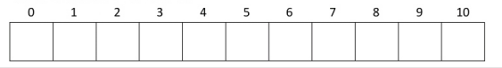

# 合工大2017试题

[](https://github.com/HFUT-cskaoyan/zhenti)  
[](#language)  
[](#commit)  
:heartpulse:**本项目是对合工大计算机850考研资料的收集和整理，一切免费面向考研er们**  
:love_letter:**如有相关资料请及时联系本账号删除**
****
## 数据结构
### 一、选择题（每小题 2 分，共 10 分）
1. 在分别以下列序列构造平衡二叉树的过程中，<u>&emsp;&emsp;</u>用到四种类型的调整操作。  
A.2,4,3,8,9,5,1
B.1,5,2,9,8,4,3
C.2,8,9,4,3,5,1
D.1,3,5,9,8,2,4
2. 下列排序算法中，____能保证在每趟排序中将第一个元素放到其最终的位置上。  
A．希尔排序&emsp;B.快速排序&emsp;c.归并排序&emsp;D.直接插入排序
3. 在图采用邻接表存储时，深度遍历算法的时间复杂度为_____。  
A.O(n)&emsp;B.O(n+e)&emsp;c. O(n2)&emsp;D.O(n3)
4. 已知一棵完余二叉树的第七层有8个叶子结点，则二叉树中的叶子结点数是____。  
A.37 &emsp;B.117&emsp;C.118&emsp;D.不确定
5. 一棵左右子树均不为空的二叉树在后序线索化后，其中空的右链域的个数是____。  
    A.0&emsp;B.1&emsp;C.2&emsp;D不确定
### 二．填空(每空3分，共15 分)
1. 判断单链表中由指针仅Р所指结点为尾结点的条件是____。
2. 删除双循环链表中的由指针Р所指示的结点的操作序列是________。
3. 在数组元素A[0]为最大元素时,冒泡排序算法所需要的比较元素的次数是__。
4. 对有序表A[22]按二分查找方法查找A[9]时,依次比较的元素下标是____。
5. 以数据集{3,6,8,9,10,12}作为叶子结点权值构造的哈夫曼树的带权路径长度是____。
### 三．解答下列各题（每小题5分，共20分)
1. 已知一棵二叉树的先序、中序如下，请构造出该二叉树。
先序:ABCDEFGHIJ
中序:BDCEAGIJHF
2. 算法阅读:
算法 Print及所引用的数组T的值如右所序号示，写出调用Print(1)的运行结果。
```c++
void Print( int i );
{
    lf ( il=O )
    { 
        Cout<<T[i].data;//输出
        Print(T[i].S);
        Print(T[i].B);
    }
}
```
| 序号 | data | S | B |
| :----:| :----: | :----: | :----: |
| 1 | A | 2 | 7 |
| 2 | B | 3 | 5 |
| 3 | C | 0 | 4 |
| 4 | D | 0 | 0 |
| 5 | E | 6 | 0 |
| 6 | F | 0 | 0 |
| 7 | G | 8 | 0 |
| 8 | H | 0 | 9 |
| 9 | I | 10 | 0 |
| 10 | J | 0 | 0 |
3. 设散列表长度为11，散列函数H(K)=K %11，采用线性探查法处理冲突，若输入序列为(10,80,12,60,78,35,42,31,15)，要求构造出散列表，并求出在等概率情况下查找成功的平均查找长度.

4. 对下面数据表执行快速排序，写出每一趟的结果，并标出第越排序过程中的元素移动情况。
(75，20，50，30，18，35，70，150，60，80，12，23，65，45)
### 四.算法设计:分别写出求解下列问题的算法，并简要写出算法设计思路。(每小题10分，共30分)
1. 设计算法将单链表L倒置（也就是将每个结点的后继指针改为指向前驱，并让头指针改为指向原来的尾结点)。
2. 设计算法以递增有序数组int[A]中元素为输入数据，构造一颗平衡的二叉排序树。
3. 设计算法以判断有向图G中是否存在一条从顶点心到vi路径，若存在，返回true，否则，返回false。
(注:本算法中可以调用以下几个函数:
firstadj(G,V)—一返回图G中顶点v的第一个邻接点的号码，券不存在，则返回0;nextadj(G,vw)——返回图G中顶点v的邻接点中处于w之后的邻接点的号码，若不存在，则返回0;
另外，若用到栈或队列之类的结构，可直接调用有关函数实现运算，不必考虑底层结构和运算的实现。)
## 计算机组成原理
### 一．单项选择题(每小题2分，共20分)
**在每个小题的四个备选答案中选择一个正确的答案。**
1. 以下关于“神威·太湖之光”超级计算机的描述中，错误的是__。  
A.它在2016年6月TOP500超级计算机系统排名中位于榜首
B.是世界上首台运算速度超过十亿次的超级计算机
c.它全部采用国产处理器构建
D.其峰值性能位于世界第一，性能功耗比位于世界第二
2. 如果某个基准测试程序在计算机A上运行需要9s，而在计算机B上运行需要6s，那么下列结论中正确的是____。  
A.计算机B的时钟频率是计算机A的2倍
B.计算机B的时钟频率是计算机A 的1.5倍
C.该程序在计算机B上的执行速度是计算机A的1.5倍
D.在计算机A电执行一条指令所需的时钟周期数是计算机B的1.5倍
3. 以下有关计算机性能指标MIPS的描述中，错误的是__。  
A.MIPS是指平均每秒执行的百万条指令数
B. MIPS越大说明机器性能一定越好
C.用MIPS 对不同机器进行性能比较不太客观
D.MIPS反映的是机器执行定点指令的速度
4. 采用计数器定时查询的总线判优方式，如果每次计数器都从“O”开始计数，那么____。  
A.设备号小的设备优先级高
B．设备号小的设备优先级低
C.每个设备的优先级轮流最高
D.每个设备的优先级相等
5. 以下对于存储器刷新操作的描述中，正确的是____。  
A．动态和静态RAM都需要刷新
B．刷新是按行进行的
C.刷新是按一个芯片接着一个芯片的顺序进行的
D.所有的刷新方式都存在“死区”
6. 以下由磁性材料构成的存储器中，__不属于辅助存储器。  
A．磁盘&emsp;B.磁带&emsp;c.磁芯&emsp;D.磁光盘
7. 如果cache 与竹村之间采用的是组相联映射方式,那么以下说法正确的是____。  
A．如果替换策略采用LRU算法，那么cache组内的行数越多则命中率越高
B.如果替换策略采用FIFO 算法，那么cache组内的行数越多则命中率越高
C. cache组的大小与命中率没有关系
D.无论采用哪种算法，cache的组越大则命中率越高
8. 中断向量给出的是____。  
A．程序断点&emsp;B.中断码&emsp;C.中断屏蔽码&emsp;D.中断服务程序的入口地址
9. 不符合RISC的主要特征的有____。  
A.CPU中配置了大量通用寄存器
B.控制器采用微程序设计
C.采用流水线方式执行指令
D.指令长度一致
10. 假设指令流经某五级流水线的五个功能短的时间一次是80ns，80ns，70ns，9ons和 50ns，那么流水线的时钟周期至少是____。  
A.90ns&emsp;B.80ns&emsp;C.70ns&emsp;D.50ns

### 二 填空题（每题分，共14分)
1. 已知字符“A”的 ASCIl 编码为100 0001，那么在字符“F”的ASCll码最前面添加一位奇校检位后的8位编码为____。
2. 采用循环冗余校检码(CRC）进行译码和纠错的依据是____。
3. 常用的两种指令寻址方式是____和____。
4. 如果把数值-128以移码形式存放在某个8位寄存器中，那么该寄存器中实际存放的内容是____。
5. 常见的两种微指令格式是____ 和 ____。
6. 假设某计算机的主存容量为64KB。按照字节编址，并且0000H~7FFFH为系统程序区，剩余地址空间为用户程序区，那么如果采用4KX8位的RAM芯片来构建用户程序区，那么需要____片这样的RAM芯片。
7. 请写出取址周期的全部微操作:____。
### 三 判断题(每题1分，共10分)
**判断下列每个叙述是否正确。如果正确，用“√”表示，否则用“×”表示。**
1. (）固件是具有软件特点的硬件。
2. ()在计算机中，数值数据×能以二进制形式表示，并且只能运行二进制运算，不能以十进制表示数据进行千进制运算。
3. ()在异步通信中，由于采用了应答方式，因而允许参与通信的模块速度不一致。
4. ()采用Flash进行读和写的速度一样快，与DRAM读写速度接近。
5. ()CPU对DMA请求和中断请求的响应时间是不一样的。
5. (）通常机器字长越长，数的表示范围越大，精度也越高。
6. (）当一个磁道存满后，新的信息会在同一个柱面的下一个盘面存放。
8. () cache 与主存采用统一编址，根据地址不同判断谤问cache还是主存。
9. ()在中断方式下，外设任何时候都可以发出中断请求,而且能得到CPu的立即响应，因此对于硬件故障可以采取强迫中断的方式。
10.  ()采用流水线方式不能缩短某一条指令的执行时间，只可能会延长。

### 四 请简要回答以下问题(10分)
1. 单周期处理器的CPI是多少?(2分)
2. 对于单周期处理器，其时钟周期在设计中如何确定的?(2分)
3. 单周期处理器中的部件在一个指令周期内能否被重复使用?请解释原因。(3分)
4. 多周期CPU的设计思想是什么?(3分)

### 五.(10分）
1. 某一个8位的计算机，数据以补码形式表示，并且机器数含1位符号位，现有整数x、y、z，其中[x]补=36H，[y]补=54H，[z]补=D5H，请分别求x-2y的机器数和x/4+2z的机器数，并指明计算结束后溢出标志 OF的值。
### 六.(11分）
1. 假定在一个程序中定义了变量a和b，其中a是float型变量（用32位的IEEE754单精度浮点数表示)，b是16位short型变量（用补码表示)。程序执行的某一时刻，如果a=-19，b= 120，并且a和 b都被写到了主存中（按字节编址)，其地址分别是100和110。请分别画出在大端机器和小端机器上变量a和b在内存中是如何存放的。