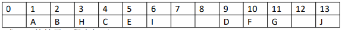

# 合工大2019试题

[](https://github.com/HFUT-cskaoyan/zhenti)
[](#language)
[](#commit)  
:heartpulse:**本项目是对合工大计算机850考研资料的收集和整理，一切免费面向考研er们**  
:love_letter:**如有相关资料请及时联系本账号删除**
****
## 数据结构
### 一.判断题（每小题 2 分，共 10 分）
1. （）由于在链队列中执行出队操作是在队头进行的，故不可能改变尾指针的值。
2. （）在二叉树顺序存储结构中，根为 1，下标为 100 的节点在右子树中。
3. （）一棵树的叶子节点，在所对应的的二叉树中的对应节点也一定是叶子节点。
4. （）在有向图采用邻接矩阵存储时，DFS 的时间复杂度是 o(n*n)。
5. （）一般来说，散列表的装填因子越大，查找长度就会越大。
### 二.填空题（每小题 3 分，共 15 分）
1. 判断带头结点的单循环链表 L 仅有一个元素节点的条件是________。
2. 在有 n 个节点的二叉链表中，值为空的指针个数_______。
3. 有 n 个顶点的强连通图的至少有________条弧. 4.高度为 7 的平衡二叉树至少有________个结点
5. 在初始数据表倒序时，冒泡排序所需要的交换无素的次数是________。
### 三、解答題（每小题 5 分，共 20 分）
1. 

求 P(1)的结果，程序如下。
```c++
void P (int i)
{
    if(i<=n &&A[i]!=nul)
    {
        P(2*i);
        cout<<A[i];
        P(2*i+1);
    }
}
```
1. 已知一稞树的先序、中序和后序序列如下其中有些位貴没有给出，请构造出该二叉树。
先序 A_ CDEF_ H_ J
中序 C_ EDA_ GFI_ 
后序 C_ _BHGJI_ _ 
3. 已知图 G 如下，求出从顶点 1 到其余各点的最短路径。（掌握该题型即可）
4. 以数据序列{2.4.3.6.7.5.1}为输入构造平衡二叉树依次写出每次出现不平衡时的状态，标出采用的调整类型以及相应的结果。
### 四.算法设计（每小题 10 分，共 30 分）
1. 设计算法在递增有序带头结点的单链表中，插入一个值为 x 的节点，并保持其递增有序特性，如果表中存在值相同的元素，则不必执行插入操作。
2. 设计一个按先序次序遍历先序线索二叉树的非递归算法，并不许用栈。
3. 设计算法判断有向图 G 中顶点 0 到每一个顶点是否都有路径，若是，返回 true，否则，返回 false。
## 计算机组成原理
### 一．单项选择题（每小题 2 分，共 20 分）
**在每个小题的四个备选答案中选择一个正确的答案。**
1. 以下说法错误的是____。  
A.计算机中没有十进制数据，因此十进制运算是通过二进制运算实现的
B.目前，生产超大规模集成电路芯片所用的原材料主要是单晶硅
C.目前，在全球超级计算机 top500 排行榜中，中国上榜的超级计算机总数位居全球第一
D.2017 年图灵奖的得主是 john L Ik，和 david A.pat。他们对 RISC 的发展具有开创性的贡献
2. 在冯诺伊曼计算机中，指令和数据都是以二进制形式存放在存储器中，cpu 区别指令和数据的依据是____。  
A.指令和数据所在的存储单元
B.指令和数据的寻址方式
C.指令和数据的译码结果
D.指令周期的不同阶段
3. 在浮点数的运算中产生溢出的原因是____。  
A.运算过程中最高位产生进位或者借位
B.运算结果的阶码超出机器的表示范围
C.运算结果的尾数超出了机器的表示范围
D.参加运算的操作数超出了机器的表示范围
4. 某个程序使用原有的编译程序编译，在处理器上运行需要 16 秒，在新编译程序发布后，新的编译产生的指令数量是旧版本编译程序的 0.5 倍，但 CPI 增加为原来的 1.2 倍，则该程序采用新编译程序后运行时间是____。  
A.38.4 &emsp;B 6.67&emsp; C.9.6 &emsp;D.19.2
5. 处理器时钟周期是 1ns，缺失代价(用于缺失处理的时钟周期)是 30 个时钟周期，命中率为 90%，cache 访问时间为 1 个时钟周期，则平均访问时间是____。  
A.4ns&emsp; B.27ns&emsp; C.28ns &emsp;D.3ns
6. 假设某 RAM 芯片，其存储容量为 8K*8 位，该芯片的引出线除了电源线和地线，最少还应有____根。  
A.21 &emsp;B.22 &emsp;C.23&emsp; D.24
7. 下面有关闪存的表述错误的是____。  
A 闪存是一种电可擦除的可编程只读存储器
B 对闪存的写操作会造成存储位损耗
C 闪存的读取速度与 DRAM 接近
D 闪存的写入速度与 SRAM 接近
8. 采用寄存器间接寻址方式，操作数在____。  
A.通用寄存器中 B .IR 中 C.地址寄存器中 D.存储器中
9. 一地址指令____。
A.只能对单个操作数进行数据加工
B.只能对两个操作数进行数据加工
C.可以对单操作数或者双操作数运算
10. 一般不能对两个以上的操作数进行运算10.微指令下地址字段的作用是____。  
A.确定指令的执行顺序
B.确定微指令的执行顺序
C.存取指令
D.存取操作数
### 二．填空题（每题 4 分，共 20 分）
1. 补码加减交替法(不恢复余数除法)和下一个余数的原则分别是____(不完整)。
2. 假设采用相对寻址的转移指令占两个字节，第一字节是操作码，第二字节是相对位移量，用补码表示。若当前的转移指令的 PC 值是 3000H，指令 JMP* 8 (其中*是相对寻址特征)的第二字节的内容是____。
3. 已知接收到的海明码为 1010010(以配偶原则配置)，那么欲传送的信息是____。
4. 根据 CPU 的访存性质不同，可以将 CPU 的工作周期分为_______、_______、_______、_______。
5. 在 CPU 中指令寄存器的作用是其______________，位数取决于_____________，程序计数器的作用是_____________，其位数致决于_____________。
### 三.简答题(第 1、2 题 8 分，第 3 题 7 分，共 23 分)
1. 请说出 RISC 技术兴起的时间，并简述 CISC 指令系统与 RISC 指令系统的特点。
2. 请给出整数原码和补码的定义并分析为何补码可以比原码多表示一个数，以及为什么是这个数？
3. 控制单元的功能是什么?并简述组合逻辑控制单元和微程序控制单元的特点。
### 四.计算题（12 分）
1. 用一个 512K*8 位的 Flash 存储芯片组成一个 4M*32 位的半导体只读存储器，请回答:
（1）   该存储器的数据线根数
（2） 该存储器的地址线根数
（3） 共需几片这种存储芯片
（4） 说明每根地址线与 Flash 存储芯片的连接方式与作