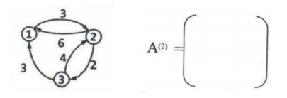

# <center>合工大2020试题</center>

[](https://github.com/HFUT-cskaoyan/zhenti)
[](#language)
[](#commit)  
:heartpulse:**本项目是对合工大计算机850考研资料的收集和整理，一切免费面向考研er们**  
:love_letter:**如有相关资料请及时联系本账号删除**
****
## <center>数据结构</center>
### 一、选择题（2×5 分）
1. 拓扑排序中，需要用一个结构来存储入度为 0 的结点，可采用（）结构。
A. 栈 B.队列 C.循环队列 D.都可以
2. 已知完全二叉树的第 6 层有 5 个叶子，满足此要求的完全二叉树最多有（）棵。
A.1 B.2 C.3 D.4
3. 在图采用邻接表存储时，求解最短路径 Dijkstra 算法的时间复杂度为（）。
A. O（n） B.O（n+e） C.O（n2） D.O（n3）
4. 下面的序列中，（）是堆。
A. （9,7,8,6,4,5,2,3） B.（9,8,6,4,3,7,2,5） C.（1,2,5,8,7,9,3,6） D. （2,9,5,7,8,4,36）
5. 下列排序算法中，（）是稳定排序。
A. 归并排序 B.希尔排序 C.堆排序 D.直接插入排序
### 二、填空题（3×5 分）
1. 元素序列 1,2,3 依次进栈，能得到_____________种不同的出栈序列。
2. 阅读下面函数，写出调用 F（3）的输出结果：___________________。 
```c++
void Func（int n）{
if（n<=0）
{ 
    cout<<1<<” ”; }
else
{
    cout<<n-1<<” ”;
    Func（n-1）;
    cout<<n-2<<” ”;Func（n-2）;
}
}
```
3. 取出广义表 A=（（a，（b），（c，d）），（e，f））中原子 c 的操作函数是_______________________________________。
4. 在有序顺序表 A[21]中，按二分查找方法查找元素，在等概率情况下，表 A的平均查找长度是______________。
5. 对下图所示有向图，按 Floyd 算法计算矩阵 A（2）。 

### 三、解答题（5×4）
6. 设有正文“a tidy tiger tied a tie”，为各字符设计一套二进制编码，使上述正文的编码最短，并计算正文的编码长度。
7. 对图 3-1 所示的线索二叉树，求解下列问题：
（1）判断为哪种次序的线索二叉树：先序、中序和后序？
（2）将新结点*s 插入到二叉树中作为结点*p 的右孩子，请写出相关的语句序列。
图 3-1 线索化二叉树
8. 图 3-2 中顶点 1 位燃气公司，其余 6 个顶点为需要铺设燃气管道的小区，可
铺设各段管道的两点之间距离如图 3-2 所示。给出一个管道铺设方案，要求铺设
的管道总长度最短。图 3-2 待铺设管道的各点距离示意图
9. 有一组 10 个学生信息的学号如下，以学号为关键字散列表到表 data[12]中，散列函数计算方法为：取学号 k 的最后两位 k1 除 11 取余，即 H（k）=k1 % 11. 用线性探查法处理冲突，画出该表，并求出在等概率情况下，查找成功时的平均查找长度。
200600123 200600121 200600210 200600201 200600214
200600311 200600313 200600304 200600307 200600404
0 1 2 3 4 5 6 7 8 9 10 11
### 四、算法设计题（10×3 分）
1. 已知顺序表 A 中元素按非降次序排列，请设计一个高效的算法以删除 A 中重复出现的元素，并分析算法的时间复杂度。例如，对顺序表（2,2,5,5,5,8,8,9）执行算法得到结果为（2,5,8,9）。
2. 已知给定的二叉树 T 各结点的值两两不同，设计算法以判断 T 是否是二叉排序树。若是，返回 TRUE，否则，返回 FALSE。
3. 在连通无向图 G 中，求出距离顶点 v0 最短路径长度为最远的一个顶点。（注意：本算法中可以调用以下几个函数）
firstadj（G，v）——返回图 G 中顶点 v 的第一个邻接点；
nextadj（G，v，w）——返回图 G 中顶点 v 的邻接点中处于 w 之后的邻接点；
node（G）——返回图 G 中的顶点数；
（如果算法中用到栈和队列，可调用其相关函数）
## <center>计算机组成原理</center>
### 一、选择题（2×15 分）
1. 以下说法错误的是______。
A.在量子计算机中，基本信息单位是量子比特（qubit）
B.编译程序员必须了解机器的硬件结构和使用的指令系统
C.在冯诺依曼计算机中，指令和数据以二进制表示，指令存放在存储器中，按地址访问，数据在指令中直接给出
D.CPU 中的算术逻辑单元属于组合逻辑电路
2. 在以下存储器中，______是破坏性读出的存储器。
A. 闪存（Flash Memory） B.DRAM C.SRAM D.EPROM
3. 以下说法正确的是_______。
A.数据通路中不包含通用寄存器
B.处理器在每个时钟信号到来时开始执行一条新的指令
C.[-1/2]补是规格化数
D.在计算机中可以进行十进制数运算，因此，在计算机中需要用二进制编码十进制数
4. 下列字符编码中，符合采用奇校验方式进行数据存储和传输，并且可能没有发
生错误的是_______。
A.1011 0011 &emsp;B.1011 0010 &emsp;C.0011 0011 &emsp;D.1010 0011
5. 如果基数为 4，那么浮点数右规的方法是___________。
A.尾数右移 1 位，阶码加 1
B.尾数右移 2 位，阶码加 2
C.尾数右移 1 位，阶码减 1
D.尾数右移 2 位，阶码加 1
6. 假设指令的一个操作数采用寄存器间接寻址，在指令中给出的寄存器为 R6，寄存器的内容（R6）=2019H，（2019H）=20FBH，（20FBH）=3035H，（3035H）=4048H，那么该操作数的有效地址是__________。
A.2019H &emsp;B.20FBH &emsp;C.3035H&emsp; D.4048H
7. 以下说法错误的是________。
A.在指令周期中，第一个阶段总是取指阶段
B.指令顺序执行时，PC 的值总是自动加 1
C.一个时钟周期就是一个节拍，机器的主频是时钟周期的倒数D.RAM 和 ROM 从存取方式看都是随机存取方式
8. DMA 方式是在_______之间建立了一条直接通路。
A.CPU 和主存&emsp; B.CPU 和 I/O 设备
C.主存和 I/O 设备&emsp; D.多个 I/O 设备
9. 在下面的通信总线中采用并行传输方式的是________。
A.USB &emsp;B.SCSI&emsp; C.RS-232&emsp; D.Type-c
10. CPU 内通用寄存器的长度取决于________。
A.存储字长 &emsp;B.指令字长
C.机器字长&emsp; D.CPU 功能
11. 在以下的操作中，完全由硬件完成的是_________。
A.保护断点&emsp; B.保护现场
C.设置中断屏蔽字&emsp; D.多个 I/O 设备
12. 某计算机有四级中断，响应优先级从高到低为 1->2->3->4。通过屏蔽字改变了处理优先级，其中，1 级中断的屏蔽字为 1001,2 级中断的屏蔽字为 1101,3 级中断屏蔽字为 1111,4 级中断的屏蔽字为 0001。那么修改后的处理优先级是_______。
A.4->1->2->3 &emsp;B.3->2->1->4
C.2->3->1->4&emsp; D.4->2->1->3
13. 波特率表示传输线上___________。
A.有效数据的传输速率&emsp; B.校验信息的传输速率
C.信号的传输速率 &emsp;D.干扰信号的传输速率
14. 在指令格式设计中，采用扩展操作码的目的是_________。
A.增加指令长度&emsp; B.缩短指令长度
C.增加寻址空间 &emsp;D.增加指令数量
15. 指令译码是对_________译码。
A.整条指令&emsp; B.指令中的操作码字段
C.指令中的地址码字段&emsp;D.指令中的操作数字段
### 二、填空题（3×5 分）
1. 假设一个整数 X 的 8 位补码位 1000 0000B，其中 1 位位符号位，那么 X 的十进制真值是___________。
2. 有一个 32 位按字节编址的存储器，CPU 从存储器中读一个数据 x=20191208H，该数据在内存中的地址是 0000 C00BH，按小端方式存放，那么存放 x 需要占用了_______个存储单元，地址 0000 C00CH 中存放的内容是__________。
3. 已知 x=-7/16，y=-13/16，[x+y]补=________，溢出标志 OF 为_________。
4. 控制单元的输入信号可以来自于__________、__________、各种状态标记和________。
5. 写出-21/128 在浮点机中的机器数，要求阶码为移码，尾数为补码规格化形式，其中，数值部分取 10 位，数符取 1 位，浮点数阶码取 5 位（包含 1 位阶符），该机器数为________________。
### 三、（8 分）
1. DMA 方式中的中断请求和程序中断方式中的中断请求有什么区别，请解释说明。
### 四、（12 分）
1. 某计算机主存地址空间为 16MB，按字节编址，主存分成 65536 块。采用直接映射的 cache 中存放数据部分的容量为 16KB（cache 的数据部分不包含有效位和标记的部分）。
（1）cache 共有多少行（块）？
（2）主存地址怎样划分？请画出主存地址字段中各段的位数和字段含义。
（3）这个 cache 的总容量（包含有效位和标记）是多少位？
###  五、（10 分）
1. 请画出计算机硬件的基本组成框图，并通过解题过程说明每一功能部件的作用以及它们之间的信息流向